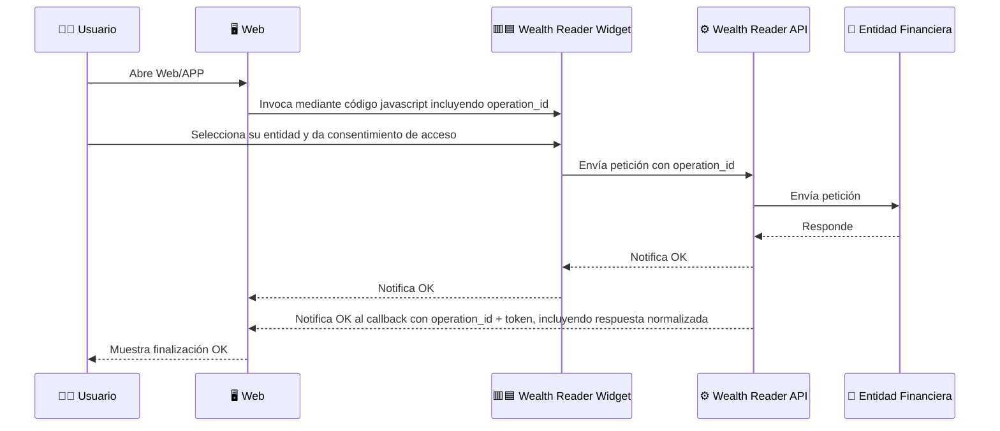

# ↔️ Flujo

```mermaid
sequenceDiagram
    participant 👨‍💼 Usuario
    participant 🖥️ Web
    participant 🟥🟦 Wealth Reader Widget
    participant ⚙️ Wealth Reader API
    participant 🏦 Entidad Financiera
    👨‍💼 Usuario->>🖥️ Web: Abre Web/APP
    🖥️ Web->>🟥🟦 Wealth Reader Widget: Invoca mediante código javascript incluyendo operation_id
    👨‍💼 Usuario->>🟥🟦 Wealth Reader Widget: Selecciona su entidad y da consentimiento de acceso
    🟥🟦 Wealth Reader Widget->>⚙️ Wealth Reader API: Envía petición con operation_id
    ⚙️ Wealth Reader API->>🏦 Entidad Financiera: Envía petición
    🏦 Entidad Financiera-->>⚙️ Wealth Reader API: Responde
    ⚙️ Wealth Reader API-->>🟥🟦 Wealth Reader Widget: Notifica OK
    🟥🟦 Wealth Reader Widget-->>🖥️ Web: Notifica OK
    ⚙️ Wealth Reader API-->>🖥️ Web: Notifica OK al callback con operation_id + token, incluyendo respuesta normalizada
    🖥️ Web-->>👨‍💼 Usuario: Muestra finalización OK
```
